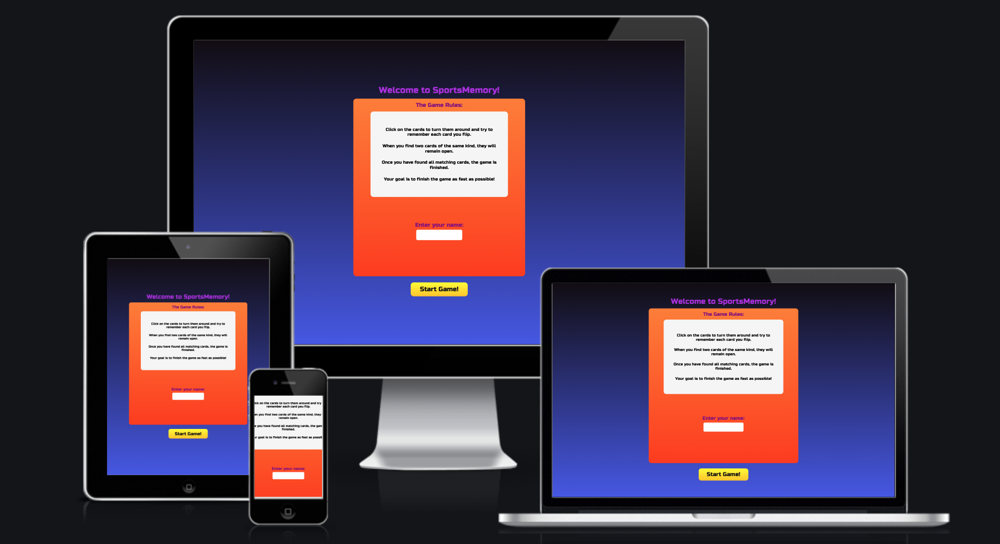
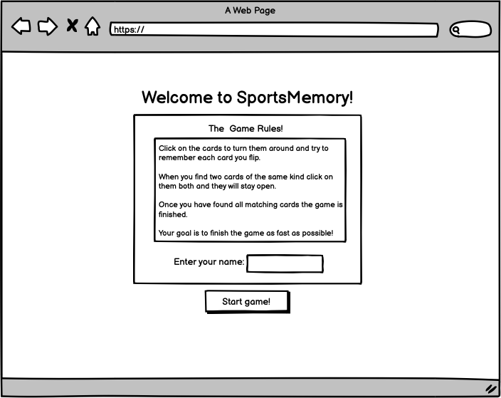
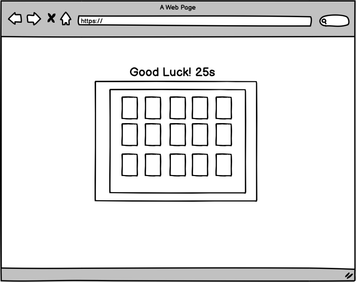
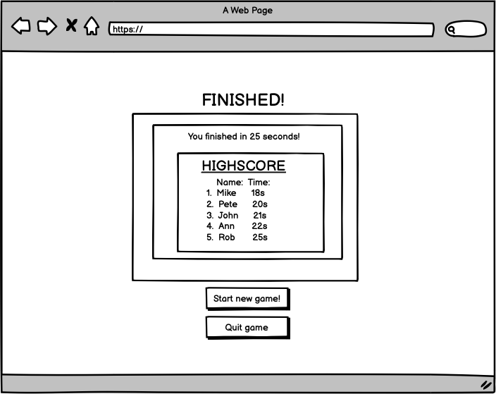
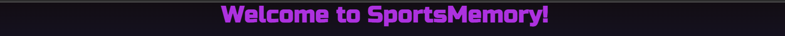
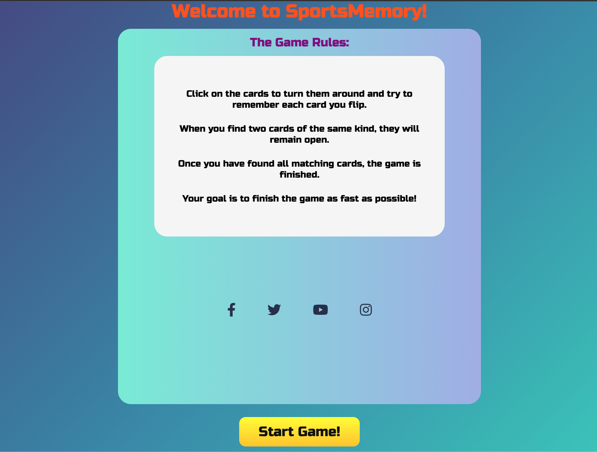
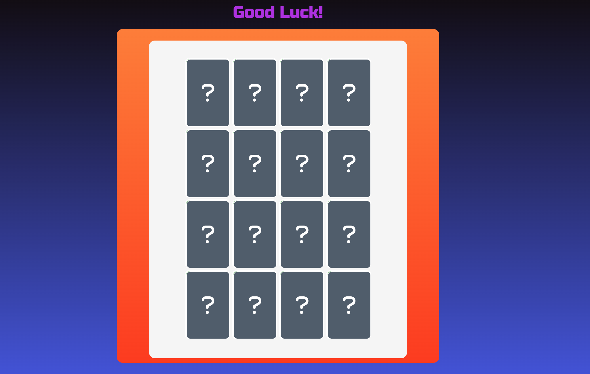
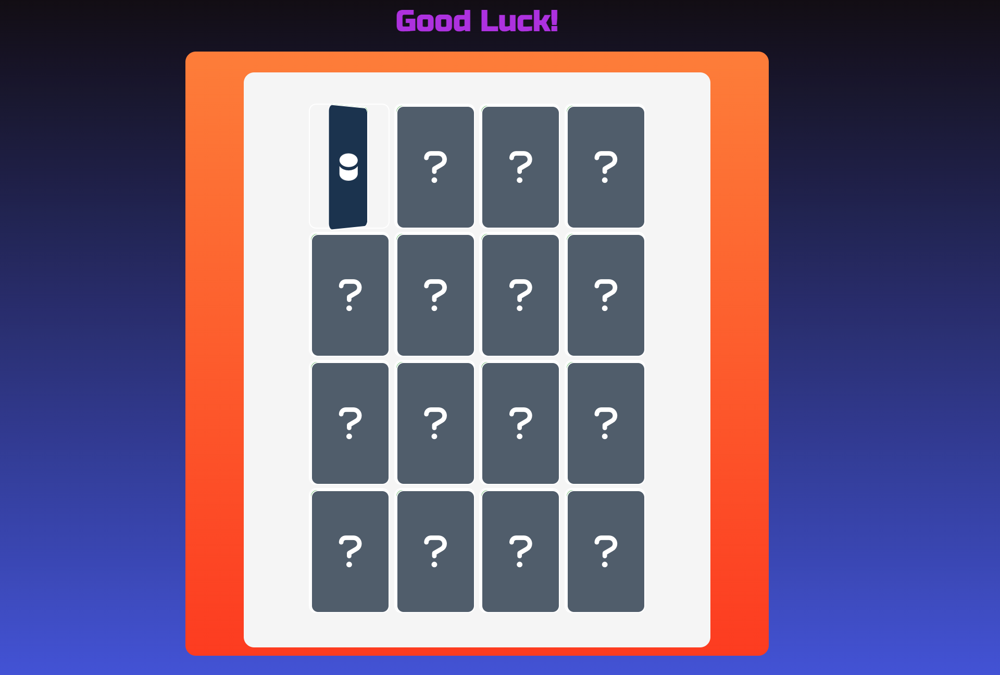
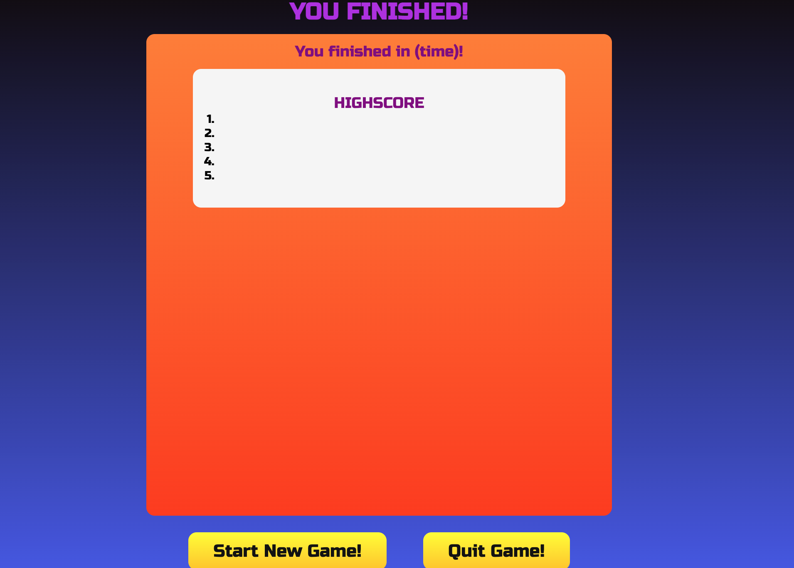

<h1 align="center">SportsMemory</h1>

-   This is a memory game with a sports theme for players who are interested in a challenging and fun game that is easy to play and quick to learn.
    

[View the live website here.](https://erikhgm.github.io/SportsMemory-Game/)

## User Experience (UX)

-   ### User stories

    -   #### First Time Visitor Goals
        As a first time visitor I expect to find information about how the game is player.  
        As a first time visitor I expect to be able to easily understand how to navigate the game  
        As a first time visitor I want to completet the game and finish it

    -   #### Returning Visitor Goals
        As a returning user I want to beat my previous time  
        As a returning user I want to improve and find the game easier to play as you go along

    -   #### Frequent User Goals
        As frequent user I expect to be able to complete the game at the best possible time  

-   ### Design
    - Color Scheme  
        For the color scheme I decided to use a gradient color to create more depth and a more dynamic overall look to the game.  
        The colors I choose are gradients of deep blue and orange-red.
    

      

    - Typography  
   

          
        For the font I decided to go with the Russo One. I beleive it gives a vibe of old arcade games that I liked and wanted to impelemet into the game and it also looks nice.

    - Imagery  
        The icons in the game are choosen to represent a sports theme with various sports related items.
       

-  ## Wireframes 
-  ### StartScreen 

-  ### GameScreen 

-  ### EndScreen 

## Existing Features

- ### Header

- ### The Start Screen 

- ### The Game Screen
    - 

- ### The Flip Card Feature
    - 

- ### The End Screen
    - 

- ### The Footer
    - The Footer includes all the social networks links

## Technologies Used

### Languages Used
 - [HTML5](https://en.wikipedia.org/wiki/HTML5)
 - [CSS3](https://en.wikipedia.org/wiki/Cascading_Style_Sheets)

### Frameworks, Libraries & Programs Used
 - [Google Fonts:](https://fonts.google.com/)
    - Used for all fonts throughout the website by import to the style.css file.
 - [Font Awesome:](https://fontawesome.com/)
    - Is used for the social media icons in the footer on all pages. 
 - [Git](https://git-scm.com/)
    - Git was used for version control through the Gitpod terminal to commit and push to GitHub
 - [GitHub:](https://github.com/)
     - Was used for all storing and backup of the code pertaining to the project. 

## Testing
-   [W3C Markup Validator](https://jigsaw.w3.org/css-validator/#validate_by_input) 
    - No errors or warnings was shown - [Results]()

-   [W3C CSS Validator](https://jigsaw.w3.org/css-validator/#validate_by_input) 
    - No errors or warnings was shown - [Results]()

-   [JSHint JavaScripy Validator](https://jshint.com/) 
    - No errors or warnings was shown - [Results]()

- [Adobe Color](https://color.adobe.com/create/color-contrast-analyzer)
    - The font color combinations were tested with Adobe color to check contrast levels for accessibility purposes.

### Testing User Stories from User Experience (UX) Section

-   #### First Time Visitor Goals
    -   As a first time visitor I expect to 

-   #### Returning Visitor Goals
    - As a returning user I expect to

    

-   #### Frequent User Goals
    - As frequent user I expect

### Further Testing
-   The game has been thoroughly 

### Known Bugs
|Bug | Solution | Status |
|----|:---------|:-------|
|  ... |  ...    | Fixed |

## Deployment

### GitHub Pages
For deployment of the project, I used GitHub Pages by following the below steps:

1. Go to [the project repository](https://github.com/ErikHgm/SportsMemory-Game)
2. Click the "Settings" button on the menu inside the repository.
3. Click the "Pages" button on the left hand menu.
4. In the dropdown menu in the Source section, select the Main branch.
5. Now the page will refresh automatically.
6. Wait until the link above the source section shows "Your site is published at (URL)". 

### Forking the GitHub Repository
1. Go to [the project repository](https://github.com/ErikHgm/SportsMemory-Game)
2. In the right most top menu, click the "Fork" button.
3. There will now be a copy of the repository in your own GitHub account.

### Running the project locally
1. Go to [the project repository](https://github.com/ErikHgm/SportsMemory-Game)
2. Click on the "Code" button.
3. Choose one of the three options (HTTPS, SSH or GitHub CLI) and then click copy.
4. Open the terminal in you IDE program. 
5. Type `git clone` and paste the URL that was copied in step 3.
6. Press Enter and the local clone will be created. 

#### Alternatively by using Gitpod:
1. Go to [the project repository](https://github.com/ErikHgm/SportsMemory-Game)
2. Click the green button that says "Gitpod" and the project will now open up in Gitpod.

## Credits

### Code
- The flip effect 

### Content
- The icons on the memorycards comes from  [FontAwesome](https://fontawesome.com/). 

### Media
- The images 

### Acknowledgements
I would like to thank: 
- The tutor support team att Code Institute for their support.
- My great Code Institute mentor Martina Terlevic for feedback and suggestions.

