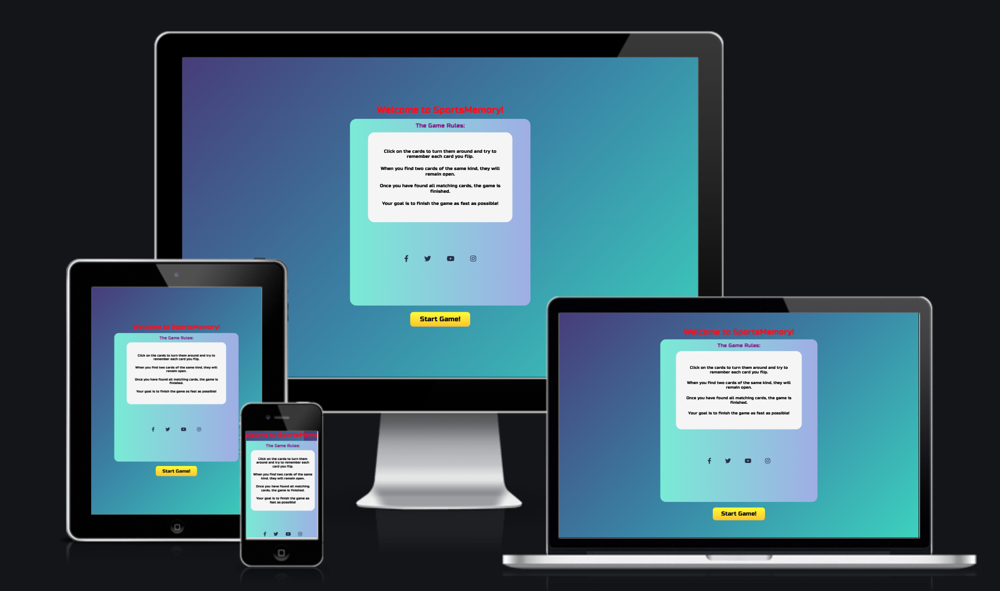
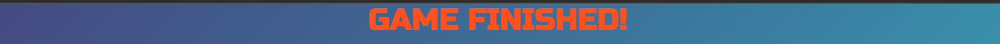
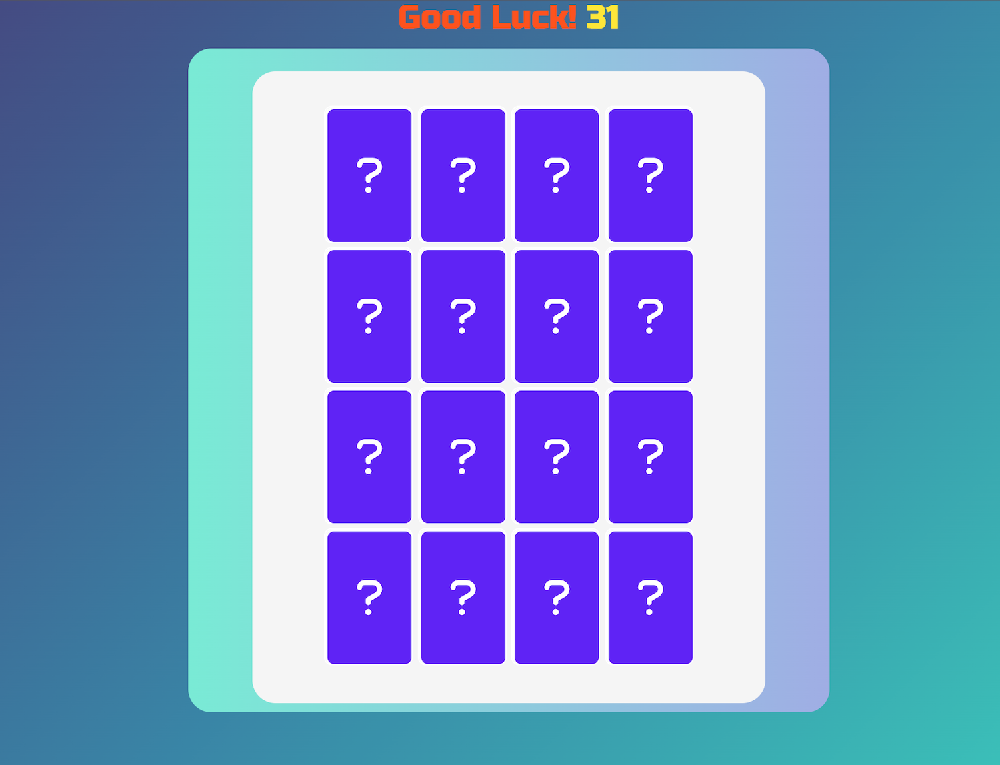
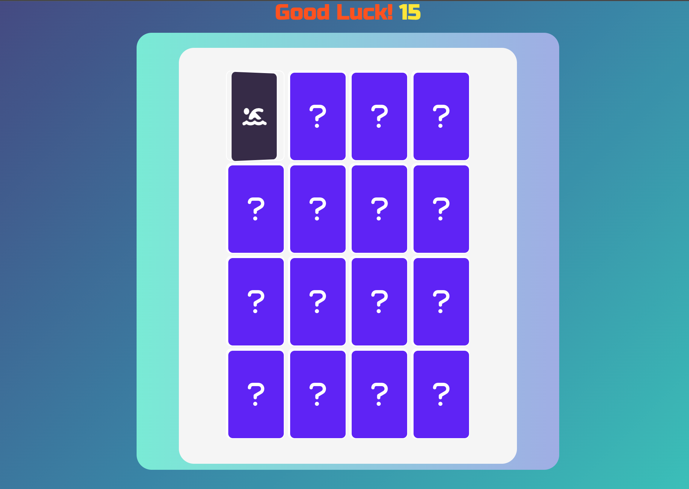
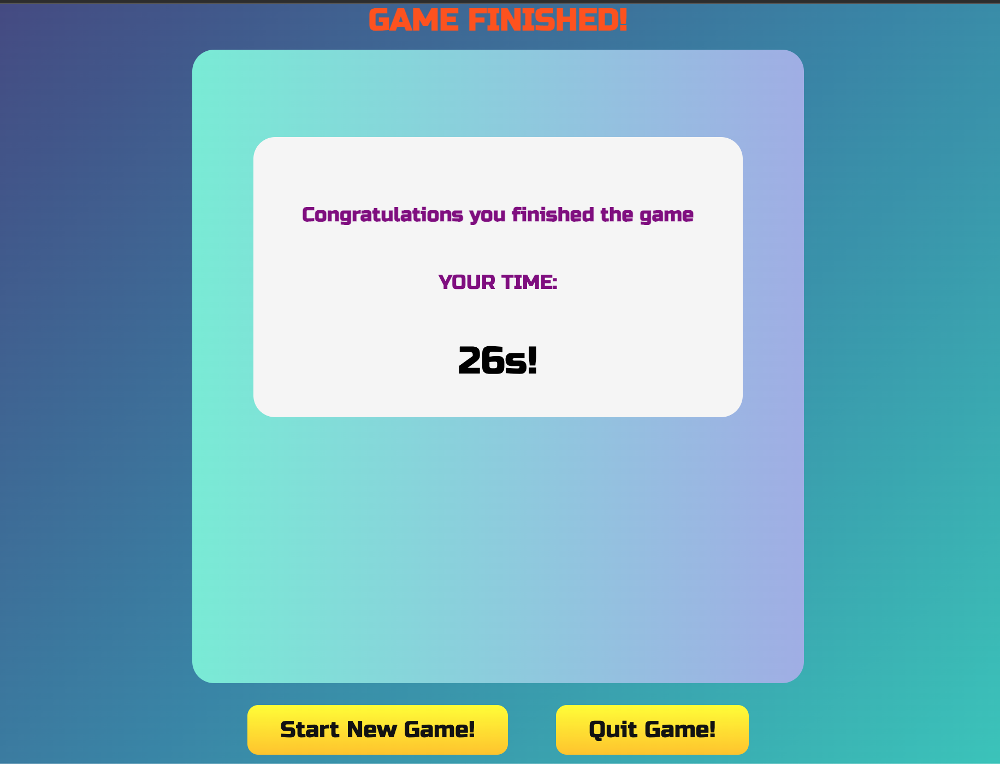

<h1 align="center">SportsMemory</h1>

-   SportsMemory is a memory game with a sports theme for players who are interested in a challenging and fun game that is easy to play and quick to learn. With a timer that checks the time it takes to complete the game, the user gets challenged to improve the time and play again. The game is intended for an audience that are looking for a quick and fun game that is challening and something you can play on the go with your mobile device.
    

[View the live website here.](https://erikhgm.github.io/SportsMemory-Game/)

## User Experience (UX)

-   ### User stories

    -   #### First Time Visitor Goals
        As a first time visitor I expect to find information about how the game is player.  
        As a first time visitor I expect to be able to easily understand how to navigate the game. 
        As a first time visitor I want to complete the game and finish it.

    -   #### Returning Visitor Goals
        As a returning user I want to beat my previous time.  
        As a returning user I want to improve and find the game easier to play as you go along.

    -   #### Frequent User Goals
        As frequent user I expect to be able to complete the game at the best possible time.  
        As frequent user I expect the game to run smoothly and function as intended.

-   ### Design
    - Color Scheme  
        For the color scheme I decided to use a gradient color to create more depth and a more dynamic overall look to the game.  
        The colors I chose are gradients of blue and green.
    

      

    - Typography  
          
        For the font I decided to go with the Russo One. I believe it gives a vibe of old arcade games that I liked and wanted to implement into the game, it looks nice as well.

    - Imagery  
        The icons in the game are chosen to represent a sports theme with various sports related icons.
       

-  ## Wireframes 
-  ### StartScreen 

-  ### GameScreen 

-  ### EndScreen 

## Existing Features

- ### Header  
    -   The header welcomes the player when entering the game page.  
    -   It also switches the message as you move over the different screens of the game.

- ### The Start Screen 
    -   The start screen explains in a concise and clear manner the rules of the game to the user.
    -   It makes it easy for the user to get started and the start button is easily accessible and visible.
    -   The start screen also shows all the various social media links to connect with. 

- ### The Game Screen
    - The game screen arrange all the cards with the back facing towards the user.
    - When the user clicks on a card it shows its icon and that way the user can try to remember each card and match the cards to each other.
    - The game screen also shows the timer which counts the seconds it takes the user to finish the game.

- ### The Flip Card Feature
    - When the player clicks on a card, the flip effect turns the card around and displays the content in an eye pleasing way.

- ### The End Screen
    - Shows the time that the user completed the game in.
    - Also includes the buttons to start over or quitting the game.

## Technologies Used

### Languages Used
 - [HTML5](https://en.wikipedia.org/wiki/HTML5)
 - [CSS3](https://en.wikipedia.org/wiki/Cascading_Style_Sheets)

### Frameworks, Libraries & Programs Used
 - [Google Fonts:](https://fonts.google.com/)
    - Used for all fonts throughout the website by import to the style.css file.
 - [Font Awesome:](https://fontawesome.com/)
    - Is used for the social media icons in the footer on all pages. 
 - [Git](https://git-scm.com/)
    - Git was used for version control through the Gitpod terminal to commit and push to GitHub.
 - [GitHub:](https://github.com/)
     - Was used for all storing and backup of the code pertaining to the project. 

## Testing
-   [W3C Markup Validator](https://validator.w3.org/) 
    - No releveant errors are shown - [Results](https://validator.w3.org/nu/?doc=https%3A%2F%2Ferikhgm.github.io%2FSportsMemory-Game%2F)

-   [W3C CSS Validator](https://jigsaw.w3.org/css-validator/#validate_by_input) 
    - No releveant errors are shown - [Results](https://jigsaw.w3.org/css-validator/validator)

-   [JSHint JavaScripy Validator](https://jshint.com/) 
    - Missing semicolons errors was shown - Fixed

- [Adobe Color](https://color.adobe.com/create/color-contrast-analyzer)
    - The font color combinations were tested with Adobe color to check contrast levels for accessibility purposes.

### Testing User Stories from User Experience (UX) Section
-   #### First Time Visitor Goals
    -  As a first time visitor I expect to find information about how the game is played.  
        -   When entering the game site, the rules of the game are shown immediately to the user.
    -  As a first time visitor I expect to be able to easily understand how to navigate the game. 
        -   Upon entering the game it is easily discoverable where to click in order to go to the next step.
    -  As a first time visitor I want to complete the game and finish it
        -   When starting the game one can explore how it functions and finish it in their own pace at the beginning.

-   #### Returning Visitor Goals
    -  As a returning user I want to beat my previous time 
        -    The game incorporates a timer that shows the time it took to complete the game. This can provide for the user to set as a goal to beat the previous time.
    -  As a returning user I want to improve and find the game easier to play as you go along
        -   After the first couple of tries in the game, it gets easier and quicker as you get accustomed to the interface.

    

-   #### Frequent User Goals
    -  As frequent user I expect to be able to complete the game at the best possible time.
        -    Once the user get to know how the game functions the chances of improving the time is greatly increased.
    -  As frequent user I expect the game to run smoothly and function as intended.
        -   The game has been thoroughly tested in order to provide the best possible user-experience without any issues that can interfere with the user.

### Further Testing
-   The website has been thoroughly tested on various browsers such as Internet Explorer, Google Chrome, Firefox, Safari and Microsoft Edge. 
-   Adaptation to different devices to make sure it scales properly has been tested using the below tools:
    -   [Responsivetesttool](http://responsivetesttool.com/)
    -   [Google Devtools](https://developer.chrome.com/docs/devtools/open/)
- The flip function and logic behind it has been tested thoroughly to make sure it works as intended.
- Google lighthouse was used to further test and validate the practices used during the development of the application
    

### Known Bugs
|Bug | Solution | Status |
|----|:---------|:-------|
| Responsiveness for mobile devices |  Debug with devtools and reduce the wrapper size and padding  | solved |
| Card flip function did not turn back the cards| Debug the setTimout function  | solved |
| If you click on the same card twice it counts as a match |  Add a class attribute to the first card being clicked| to be solved |

## Features left to implement
-   A highscore list that stores and displays the top 5 best times that the user managed to complete the game in.

## Deployment

### GitHub Pages
For deployment of the project, I used GitHub Pages by following the below steps:

1. Go to [the project repository](https://github.com/ErikHgm/SportsMemory-Game)
2. Click the "Settings" button on the menu inside the repository.
3. Click the "Pages" button on the left hand menu.
4. In the dropdown menu in the Source section, select the Main branch.
5. Now the page will refresh automatically.
6. Wait until the link above the source section shows "Your site is published at (URL)". 

### Forking the GitHub Repository
1. Go to [the project repository](https://github.com/ErikHgm/SportsMemory-Game)
2. In the right most top menu, click the "Fork" button.
3. There will now be a copy of the repository in your own GitHub account.

### Running the project locally
1. Go to [the project repository](https://github.com/ErikHgm/SportsMemory-Game)
2. Click on the "Code" button.
3. Choose one of the three options (HTTPS, SSH or GitHub CLI) and then click copy.
4. Open the terminal in you IDE program. 
5. Type `git clone` and paste the URL that was copied in step 3.
6. Press Enter and the local clone will be created. 

#### Alternatively by using Gitpod:
1. Go to [the project repository](https://github.com/ErikHgm/SportsMemory-Game)
2. Click the green button that says "Gitpod" and the project will now open up in Gitpod.

## Credits

### Code
- Inspiration on how to do the 3D flip effect came from the Youtube channel: [freeCodeCamp.org](https://www.youtube.com/watch?v=ZniVgo8U7ek). 

### Content
- The icons on the memorycards comes from [FontAwesome](https://fontawesome.com/). 

### Acknowledgements
I would like to thank: 
- The tutor support team at Code Institute for their help with code guidance and solutions.
- My great Code Institute mentor Martina Terlevic for feedback and suggestions.
- W3Scools for tips and trix [W3Schools](https://www.w3schools.com/ ).

